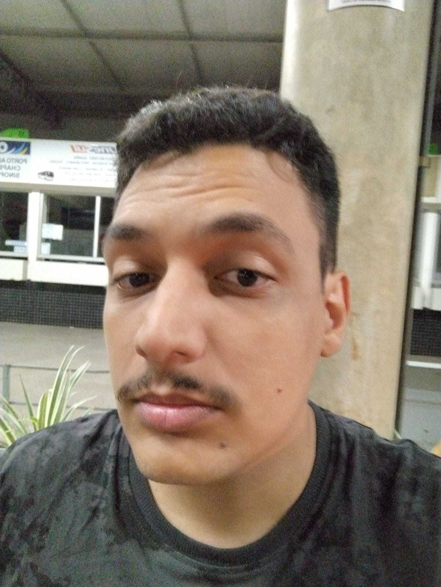

# Informações pessoais.
**Nome:** Edgar de Rosis da Silva      

**Instituição de Ensino:** UFMS, campus de Campo Grande

## Experiencias:
- Curso Pantanal.dev com foco em microserviços.
- **Conhecimentos:** Java, AndroidStudio (java), SQL, Python, C++, Teste de Software, Teste de Mutação, 

## Hobbies:
- Jogos Eletrônicos
- Livros
- Filmes
- Series
- Viagens
- Sair para beber/comer

# Informações das Sprints

## Sprint1
